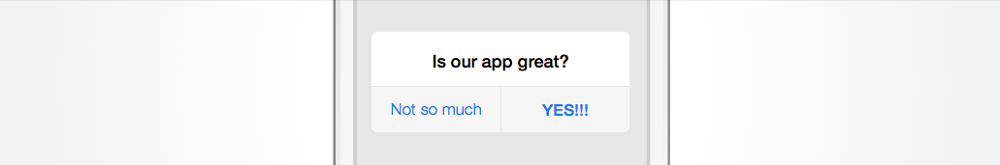
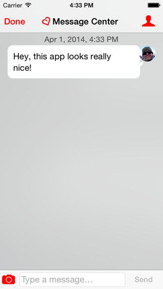
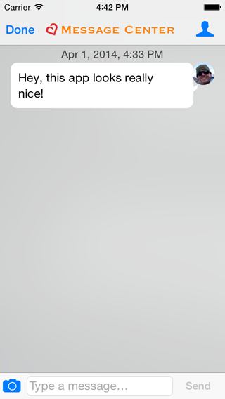
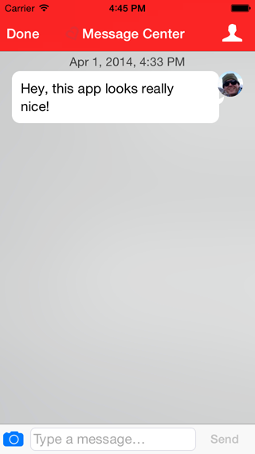
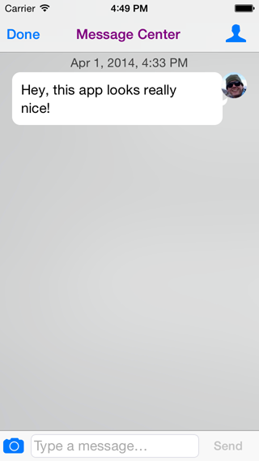
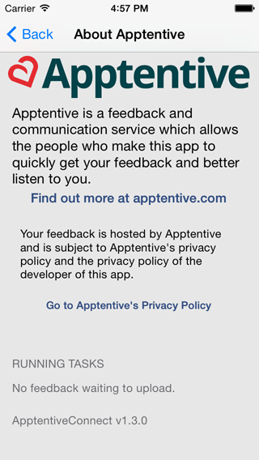

# Interface Customization

We are starting to work on making the UI more customizable without relying on modifying the source directly.

If you have a need for customizing the UI beyond what is covered below, [we'd love to hear from you!](http://apptentive.com/contact/)

In the meantime, this information should be correct for the current version of the SDK, but is subject to change as we add more customization options. As always, check the changelog and API changes documents when upgrading.

## Customizing Text

You can now customize the text in the ratings prompt from your Apptentive dashboard. Just go to "Interactions" on the top tab, then to "Ratings Prompt" on the left, and you'll be able to customize all of the text for the ratings flow.

For example:



There are some caveats:

* Apptentive includes translations in **12 languages**. By changing the text here you will replace the English version of the prompts with your own customized version.
* Devices that have a different default language than English will continue to receive the localized version of the default Apptentive prompt.

We are planning on adding support for localizing these strings from the server and for customizing more of the text in our UI as we move forward. If one of these is a priority for you, [please let us know](http://apptentive.com/contact/)!

## Customization Using UIAppearance

If you change the `tintColor` of your app, we will automatically pick it up.

```objective-c
[[UIView appearance] setTintColor:[UIColor redColor]];
```



Similarly, you can change the attributes of the text of the navigation bar, and we should take those attributes:

```objective-c
NSDictionary *attributes = @{UITextAttributeTextColor: [UIColor orangeColor],
                             UITextAttributeFont: [UIFont fontWithName:@"Copperplate" size:20]};
[[UINavigationBar appearance] setTitleTextAttributes:attributes];
```



Unfortunately, you'll currently need to set some appearance attributes on our custom subclass of `UINavigationController`, as below:

```objective-c
Class apptentiveNavigationController = NSClassFromString(@"ATNavigationController");
if (apptentiveNavigationController) {
    [[UINavigationBar appearanceWhenContainedIn:apptentiveNavigationController, nil] 
        setBarTintColor:[UIColor redColor]];
    [[UINavigationBar appearanceWhenContainedIn:apptentiveNavigationController, nil] 
        setTintColor:[UIColor whiteColor]];
}
NSDictionary *attributes = @{UITextAttributeTextColor: [UIColor whiteColor]};
[[UINavigationBar appearance] setTitleTextAttributes:attributes];
```

which yields:



That is, unless you disable our branding with the `-setShowTagline:` method:

```objective-c
[[ATConnect sharedConnection] setShowTagline:NO];
NSDictionary *attributes = @{UITextAttributeTextColor: [UIColor purpleColor]};
[[UINavigationBar appearance] setTitleTextAttributes:attributes];
```

In which case you'll get:



*Note:* We will likely change this moving forward to be more consistent, API-wise.

## Removing Apptentive Branding

The `-setShowTagline:` method:

```objective-c
[[ATConnect sharedConnection] setShowTagline:NO];
```

Can be used to disable showing the Apptentive logo at the top of the Message Center and on the Contact Settings screen.

The Apptentive logo will still be displayed on the About Apptentive screen, which can be reached by tapping the white bar at the bottom of the Contact Settings screen. The About Apptentive screen looks like this:



## Customization as Submodule

Our *least-recommended* method of customization is to fork `apptentive-ios` and add it as a submodule to your project.

Doing so would allow you to change the UI more invasively, while letting you merge in changes from the main project as they come in. We generally discourage this as it tends to be a high maintenance process.

If you have customizations you'd like in our project, the best way to get them is to [let us know](http://apptentive.com/contact/). We're happy to discuss them!

